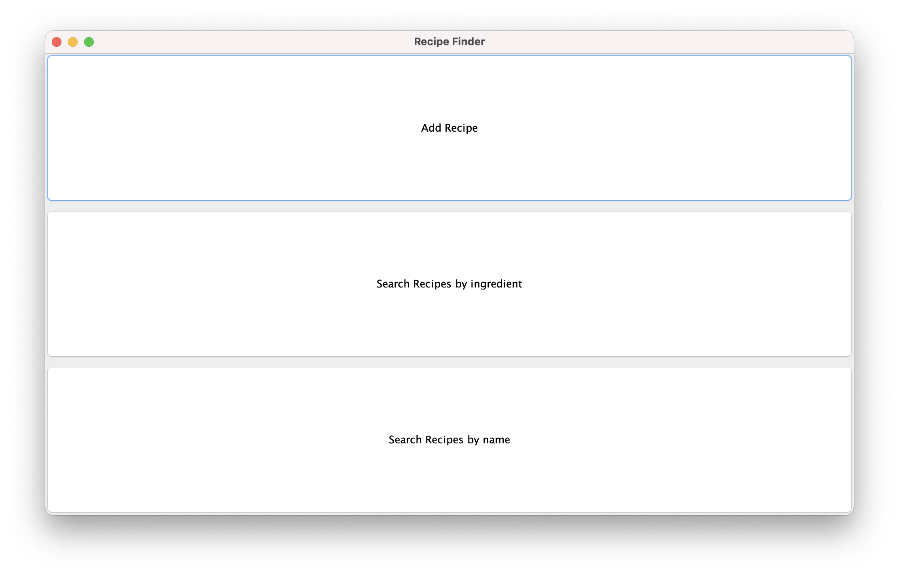

# Recipe Finder

## Features

* Adding New Recipes
* Searching Recipes by name
* Searching Recipes by ingredients
* Editing Recipes
* Deleting Recipes

## Running the program

There is a `Recipe Finder.jar` file in the target directory that
is already packaged. If you wish to compile this yourself and create a jar in the 
`target/` directory, switch to the root directory (the directory of this file),
and run `./mvnw clean package` if using a Unix-based operating system
or run `./mvnw.cmd clean package` if using Windows. To execute that jar,
you can run `java -jar "target/Recipe Finder.jar"`. If you only want 
to run the file, run `./mvnw compile exec:java` or `./mvnw.cmd compile exec:java`

## Deleting the program

To delete this program, delete this directory. However, the recipes
that the program created are stored in the `.recipes/` folder in the
user's home directory. Delete that as well.
